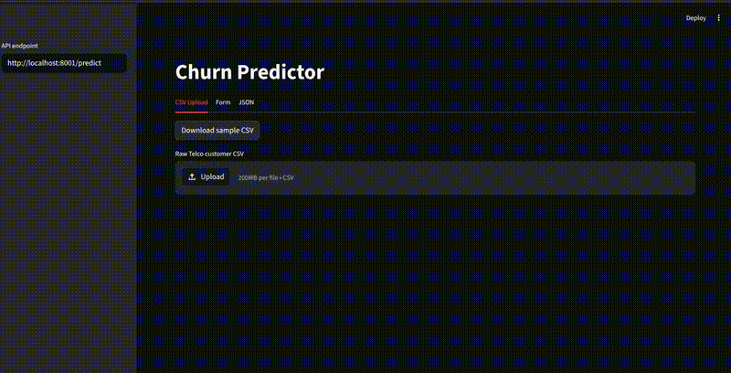
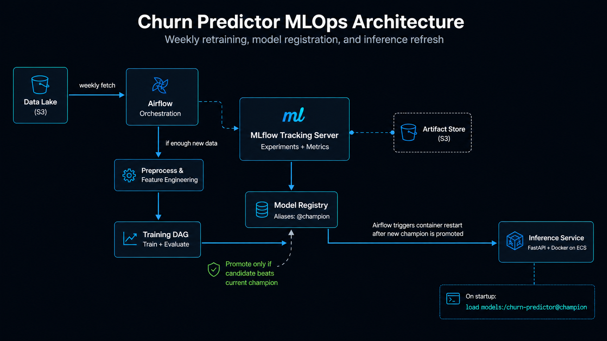

# Churn Predictor

An end-to-end local MLOps project for customer churn prediction. It uses MinIO as an S3-compatible dataset/artifact store, MLflow for experiment tracking and model registry, Airflow for retraining orchestration, FastAPI for inference, and Streamlit for the user-facing prediction UI.



## Architecture



## Quick Start

From the repository root:

```bash
./run_local.sh
```

That single script will:

- install/update local Python dependencies with `uv sync`
- start Docker services for Postgres, MinIO, MLflow, and the FastAPI image
- seed MinIO with `data/WA_Fn-UseC_-Telco-Customer-Churn.csv`
- start Airflow locally with the DAGs in `mlops/`
- start Streamlit locally

Useful URLs:

| Service | URL | Credentials |
|---|---|---|
| Streamlit UI | http://localhost:8501 | none |
| FastAPI docs | http://localhost:8001/docs | none |
| API health | http://localhost:8001/health | none |
| Airflow | http://localhost:8080 | `admin` / `admin` |
| MLflow | http://localhost:5000 | none |
| MinIO Console | http://localhost:9001 | `minioadmin` / `minioadmin` |

Manage the local stack:

```bash
./run_local.sh status
./run_local.sh stop
./run_local.sh restart
```

If your Docker daemon requires sudo, the script will use passwordless `sudo docker` when available. Otherwise, add your user to the Docker group or run the Docker services manually.

## First Training Run

The API starts before a model exists, but `/predict` returns `503` until a champion model is promoted in MLflow.

To train one:

1. Open Airflow at http://localhost:8080.
2. Trigger the DAG named `c_training_pipeline`.
3. Wait for `fetch_data_from_s3 -> preprocess_training_data -> train_churn_model` to finish.
4. Check MLflow at http://localhost:5000 for the registered `churn-predictor` model.

If the trained model passes the promotion gates, it receives the `@champion` alias. The API resolves:

```text
models:/churn-predictor@champion
```

## Streamlit UI

The UI is in [main.py](main.py) and can also be run directly:

```bash
uv run streamlit run main.py
```

It calls the API at `http://localhost:8001/predict` by default. Override it with:

```bash
API_URL=http://localhost:8001/predict uv run streamlit run main.py
```

Input modes:

- CSV Upload: upload raw Telco-style customer files shaped like `WA_Fn-UseC_-Telco-Customer-Churn.csv`
- Form: fill one customer interactively
- JSON: send raw preprocessed feature payloads

Sample upload file:

[data/churn_upload_sample.csv](data/churn_upload_sample.csv)

## API

The API lives in [api/](api/) and has its own Docker image definition:

[api/Dockerfile](api/Dockerfile)

Build just the API image:

```bash
docker compose -f dev.yml build api
```

Run just the Docker-backed services:

```bash
docker compose -f dev.yml up -d --build postgres minio mlflow api
```

### `GET /health`

```bash
curl http://localhost:8001/health
```

Example response:

```json
{
  "status": "ok",
  "model_uri": "models:/churn-predictor@champion",
  "model_loaded": false
}
```

### `POST /predict`

The API expects preprocessed model features. Streamlit handles raw CSV transformation before calling this endpoint.

```bash
curl -X POST http://localhost:8001/predict \
  -H "Content-Type: application/json" \
  -d '{
    "instances": [
      {
        "SeniorCitizen": 0,
        "Partner": 1,
        "Dependents": 0,
        "tenure": 12,
        "PaperlessBilling": 1,
        "MonthlyCharges": 70.0,
        "TotalCharges": 850.0,
        "InternetService_Fiber optic": 1,
        "InternetService_No": 0,
        "OnlineSecurity_No internet service": 0,
        "OnlineSecurity_Yes": 0,
        "OnlineBackup_No internet service": 0,
        "DeviceProtection_No internet service": 0,
        "TechSupport_No internet service": 0,
        "TechSupport_Yes": 0,
        "StreamingTV_No internet service": 0,
        "StreamingMovies_No internet service": 0,
        "Contract_One year": 0,
        "Contract_Two year": 0,
        "PaymentMethod_Credit card (automatic)": 0,
        "PaymentMethod_Electronic check": 1
      }
    ]
  }'
```

Response:

```json
{ "predictions": [1] }
```

## Training Pipeline

The Airflow DAG is defined in [mlops/c_training.py](mlops/c_training.py).

Pipeline tasks:

```text
fetch_data_from_s3 -> preprocess_training_data -> train_churn_model
```

Training logic lives in [src/training.py](src/training.py):

- model: XGBoost binary classifier
- tuning: `GridSearchCV`
- tracking: MLflow
- registry name: `churn-predictor`
- champion alias: `champion`

Promotion gates:

| Gate | Condition |
|---|---|
| Minimum quality | `roc_auc >= 0.84` and `recall >= 0.65` and `f1 >= 0.60` |
| Beat champion | candidate beats current champion on all three metrics |

## Data

Raw training data:

[data/WA_Fn-UseC_-Telco-Customer-Churn.csv](data/WA_Fn-UseC_-Telco-Customer-Churn.csv)

Preprocessing lives in [data/preprocessing.py](data/preprocessing.py). It converts raw Telco customer rows into the 21 feature columns expected by the model.

## Cleanup

Generated local runtime files are ignored by git:

- `.airflow/`
- `logs/`
- `mlartifacts/`
- local `*.db` files
- Python caches
